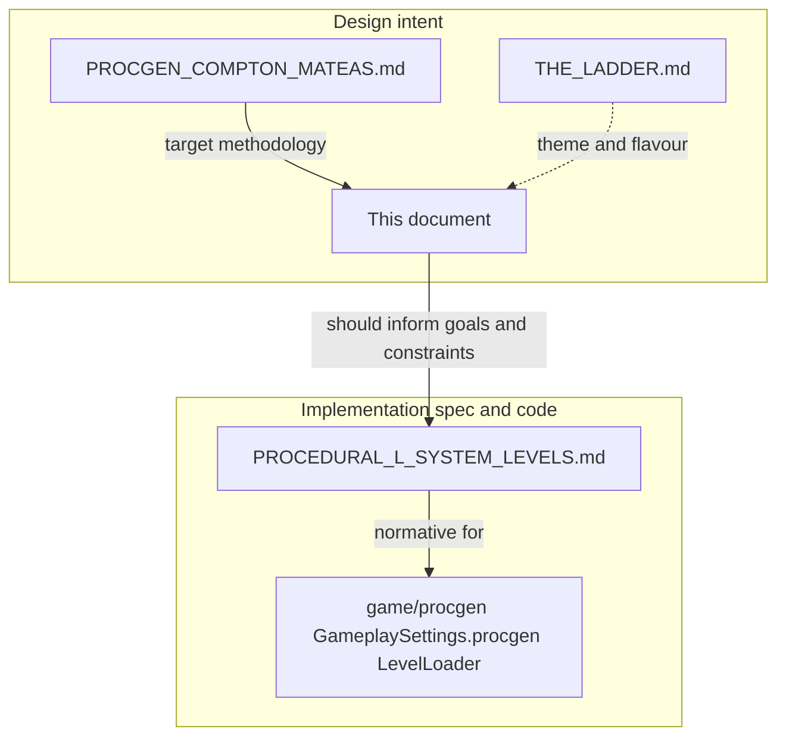
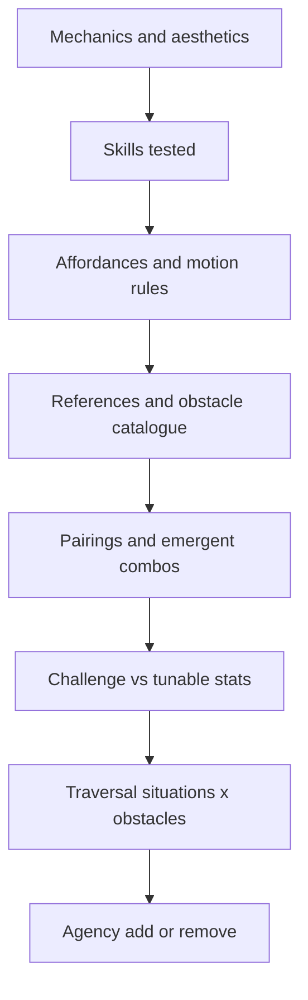

# Level design and generation — methodology

**Document type:** design specification (principles and targets)  
**Code:** informs `game/procgen/` and future work; **not** a line-by-line substitute for the implementation spec  
**Status:** design-normative — team alignment on *why* we generate levels and *what* good looks like

**Target methodology (procgen overhaul):** levels should move toward the **Compton & Mateas (2006)** four-layer model — **repetition**, **rhythm**, and **connectivity** — with explicit playability constraints for platform-style motion. See [PROCGEN_COMPTON_MATEAS.md](PROCGEN_COMPTON_MATEAS.md) for citation, principles, and migration outline. The shipped **L-system** pipeline remains documented in [PROCEDURAL_L_SYSTEM_LEVELS.md](PROCEDURAL_L_SYSTEM_LEVELS.md) until that migration is implemented.

**Related documents**

| Document | Role |
|----------|------|
| [PROCGEN_COMPTON_MATEAS.md](PROCGEN_COMPTON_MATEAS.md) | **Target** procgen methodology (Compton & Mateas 2006) and roadmap from current pipeline |
| [PROCEDURAL_L_SYSTEM_LEVELS.md](PROCEDURAL_L_SYSTEM_LEVELS.md) | **Implementation** spec: current L-system pipeline, turtle, descriptor contract |
| [../specs/SPEC.md](../specs/SPEC.md) | **Technical** contract: stack, commands, level bundle, MVP scope |
| [THE_LADDER.md](THE_LADDER.md) | **Creative direction**: corporate ladder theme, flavour hazards |

---

## How this fits the codebase

Design intent should eventually align with the shipped generator. Today, **implementation** follows the procedural pipeline; **this file** records the methodology we want levels to satisfy and the gap to close.

**Implementation traceability:** `game/procgen/*.js`, `GameplaySettings.procgen` in `game/config/GameplaySettings.js`, `LevelLoader`, and `loadRoadTextures` include file-level comments linking **this document**, **PROCEDURAL_L_SYSTEM_LEVELS.md**, and **THE_LADDER.md** (see also the code ↔ docs map in **PROCEDURAL_L_SYSTEM_LEVELS.md** §2).

---

## 1. Core mechanics and aesthetics

**In scope for the current prototype** (see [SPEC.md](../specs/SPEC.md)):

- **Procedural courses** — levels generated at load from `levelIndex`, not hand-authored JSON geometry for the main run.
- **Rolling** — torque on a rigid-body marble (`WASD` / arrows).
- **Brake** — damping linear and angular velocity while **Shift** is held.
- **Jump** — single upward impulse when grounded (`Space`).
- **Camera** — third-person orbit (yaw / pitch), independent of roll direction.
- **Goal** — reach a position within capture radius (plus marble radius in the win test).
- **Zones** — start pad (green) and end pad (gold); procgen may require touching start before end counts.
- **Death** — fall below a per-level kill plane; **restart** current level (**R** / confirm), no mid-level checkpoint in the MVP contract.
- **Presentation** — optional road diffuse textures on segment tops; theme is layered on top of descriptor geometry.

**Out of scope for MVP** (per SPEC): gems, timers, power-ups, multiplayer, checkpoint saves, level editor.

**Aesthetic target:** readable **floating course** geometry, wide enough early path to learn roll and jump, then **tighter** reading of turns, ramps, and vertical shifts. Creative tone may follow [THE_LADDER.md](THE_LADDER.md).

---

## 2. Skills under test

This is **not** a fixed run-speed platformer: movement is **momentum-based rolling** plus **one jump**. Reframe classic “jump distance” skills as follows:

| Skill | Manifestation in marble_roll |
|-------|-------------------------------|
| **Timing** | Releasing brake before a gap, jumping off a ramp or after a vertical splice. |
| **Precision** | Holding a line on narrower tiles, steering weave-heavy spines. |
| **Distance judgement** | Whether the marble carries enough speed to clear a **gap** (removed tile) or land after arc. |
| **Speed control** | Torque vs brake to avoid overshooting tight turns or thin path segments. |
| **Recovery** | Getting back on course after a bump or a bad bounce (when moving hazards exist later). |

---

## 3. Motion affordances (design targets)

**Authoritative tuning** lives in code: [`ControlSettings.js`](../../game/config/ControlSettings.js) (torque, jump impulse, brake), [`PhysicsSystem.js`](../../game/systems/PhysicsSystem.js) (mass **2**, gravity **−28**, marble radius **0.5**, grounded ray), [`GameplaySettings.js`](../../game/config/GameplaySettings.js) (`procgen` path width and L-system bands), and [`generateProcgenDescriptor.js`](../../game/procgen/generateProcgenDescriptor.js) (`verticalStep`, `jumpClearance`, turtle `step`).

**Design invariants** (targets — validate in a future **gym** scene: flat tiles, measured gaps, repeat jumps):

- **Jump** — `jumpImpulse` is chosen so peak height and hang time stay **fair** relative to `verticalStep` stacks and splice offsets (~`jumpClearance` **0.92** vs **0.38** per `^`/`v` step in the current pipeline).
- **Forward motion** — `procgenTurtleStep(levelIndex)` sets chord length per `F`; course **length** scales with L-system **iterations** (see `procgenLSystemIterations`). Small per-level step growth avoids brutal world-scale jumps between rungs.
- **Gaps** — `placeObstacles` may remove **one** tile mid-path when the path has more than **`GameplaySettings.procgen.minStaticCountForGap`** boxes (default **5**, i.e. **n ≥ 6**); effective gap width ties to **tile spacing** and approach speed. At least **one** obstacle (gap and/or lattice) is applied whenever **`n ≥ 2`** (§5.6).
- **Narrow vs wide** — `widenPlatforms`, `applySegmentStyles`, and `procgenPathHalfXZBase` create **agency-like** width variation on a **single** spine (wider strips, occasional `pathWide`).

Until a gym exists, treat these as **guidelines** checked by playtesting, not formal proofs.

---

## 4. Reference library — obstacles and patterns

Use external games as **vocabulary**, not as physics templates. Below: **reference** rows (illustrative) and **shipped** rows (this build).

| Name / pattern | Origin (examples) | Skill stressed | Stats / telegraph (typical) | MDA (sketch) | Pairing notes |
|----------------|-------------------|----------------|-----------------------------|--------------|---------------|
| Moving platform | Mario, Donkey Kong | Timing, prediction | Speed, path, acceleration | M: moving collider · D: rhythm of safe windows · A: “industrial / playful” | Combines with gaps or hazards that force waiting |
| Cycle hazard (fire bar, sweep) | Mario, Zelda | Rhythm, patience | Period, radius | M: periodic damage volume · D: learn cycle · A: tension | With narrow landings |
| Crumbling / timed platform | Meat Boy, Crash | Commitment, pace | Time visible on tile | M: destroy collider after step · D: rush vs safety · A: anxiety | With long jumps after |
| **Gap (missing tile)** | Many | Speed judgement, line | Width = one tile removal | M: no collider in span · D: commit or roll in · A: exposure / vertigo | **Shipped:** `placeObstacles` removes one box when path long enough |
| **Lattice (non-solid top)** | Visual-only hazard | Risk of slip / reading | No collision, still visible | M: `collision: false` · D: must not rely on support · A: “broken road” | **Shipped:** one tile flagged lattice |
| One-way / door | Platformers | Routing | State, trigger | M: conditional pass · D: plan route · A: discovery | Needs branching or revisit — **not** in current spine |
| **Corporate flavour hazards** | [THE_LADDER.md](THE_LADDER.md) | Theme + future mechanics | TBD | TBD | Evaluate with §6 and §8 when implemented |

**MDA reminder:** *Mechanics* = rules; *Dynamics* = runtime behaviour when played; *Aesthetics* = player-facing feel. Use the pairing column to note **emergent** mixes (e.g. moving hazard + forced wait + disappearing floor).

---

## 5. Deeper interactions and emergent situations

**Desired combinations** (directional — implementation may lag):

- **Vertical splice + momentum** — later rungs insert `^` / `v` bursts so the **tail** of the path shifts height; players must read **speed** into upslope or **control** descent.
- **Gap + narrow segment** — a single removed tile after a **tight** tile raises difficulty without extra enemies.
- **Ramp (`r`) + jump** — sloped exits change exit velocity; pairs well with **timing** challenges once ramps are used deliberately around obstacles.

**Combinations to use sparingly** (until proven fun):

- Multiple independent **precision** demands in one row (gap + lattice + minimum width + splice) without a **recovery** plaza.
- **Opaque** telegraphs (player cannot see kill plane or next landing).

---

## 6. Challenge and perceived difficulty

Rough mapping from **tunable dimensions** to **feel** (see `GameplaySettings.procgen` and post-process stages):

| Knob (concept) | Effect on player |
|----------------|------------------|
| More L-system **iterations** | Longer symbol string → longer course (exponential growth — use bands and caps). |
| Larger **turtle step** | Physically longer tiles — faster world-scale expansion per rung. |
| Narrower **path half-width** (late decay) | Less room for error on **line**; **wider** early bonus eases onboarding. |
| More **splices** (`levelIndex`, candidate density) | More vertical discontinuities — harder **reading** and jump timing. |
| **Plaza** half-extent | Large start pad — safety and **agency** to pick approach line. |
| **Obstacle count** (currently 0–2 features) | Gap + lattice change **risk** without new AI. |

Tune **one dimension at a time** when playtesting; [How to Make Insane, Procedural Platformer Levels](https://www.gamedeveloper.com/design/how-to-make-insane-procedural-platformer-levels) stresses validating **rules** before scaling randomness.

---

## 7. Traversal situations (taxonomy)

Use this list when **authoring** future chunks or **reviewing** generated courses. Pair with §4 obstacle rows.

| Situation | Description | Obstacle stress-test ideas |
|-----------|-------------|----------------------------|
| **Flat approach** | Level entry or after plaza | Line holding, optional gap |
| **Weave** | Many turns in plan | Precision, speed control |
| **Ramp exit** | `r` segments | Jump timing, exit speed |
| **Post-splice** | Height jumps mid-string (`levelIndex ≥ 1`) | Vertical judgement, brake |
| **Narrow bridge** | Minimum width tile | Precision; pair with lattice carefully |
| **Wide safety** | `pathWide` or plaza-like span | Recovery; optional agency |
| **No safety net** | Gap with deep fall | Commitment; keep rare early |

---

## 8. Agency

**Principle:** give players **options** — extra width, visible alternate lines, or optional platforms — so engagement stays high even when mechanics are simple. As difficulty rises, **optional** harder lines can appear; at the **peak**, some designers **remove** agency to force commitment (use rarely and deliberately).

**Current build (honest):**

- **Single main spine** — no `[` / `]` branches in the shipped L-system; one forward route to the goal.
- **Agency** is mostly **width variation** (`pathWide`, plaza, span hash), not parallel paths.
- **Randomised optional platforms inside chunks** — **not** implemented; document as **roadmap** if we add authored **chunk libraries** with toggles.

---

## 9. Current implementation vs target direction

| Aspect | Current (see [PROCEDURAL_L_SYSTEM_LEVELS.md](PROCEDURAL_L_SYSTEM_LEVELS.md)) | Target direction |
|--------|------------------|------------------|
| Route topology | Single non-branching spine | Optional chunk graphs or branch symbols if design requires |
| Length control | L-system iterations + budgets + splices | Same plus **authored** length caps per rung theme |
| Obstacles | Deterministic gap + lattice | Richer library; moving bodies; theme hazards from THE_LADDER |
| Validation | Playtesting | Add **gym** level: fixed gaps, ramps, jumps for measuring affordances |
| Agency | Width and plaza | Optional platforms / chunk toggles |

---

## 10. Methodology workflow (reference)

High-level order of operations when designing or overhauling content:

---

## 11. Bibliography

1. Garret Bright, *Build a Bad Guy Workshop: Designing enemies for retro games*, Game Developer (formerly Gamasutra), 2014.  
   https://www.gamedeveloper.com/design/build-a-bad-guy-workshop---designing-enemies-for-retro-games  
   — Useful for **telegraph**, **stats**, and **depth** of individual hazards; adapt to non-enemy obstacles (gaps, movers) as needed.

2. Jordan Fisher / feature, *How to Make Insane, Procedural Platformer Levels*, Game Developer.  
   https://www.gamedeveloper.com/design/how-to-make-insane-procedural-platformer-levels  
   — Complements our **rules-first** procgen: establish constraints, then scale variety.

3. Internal: [PROCEDURAL_L_SYSTEM_LEVELS.md](PROCEDURAL_L_SYSTEM_LEVELS.md) — pipeline stages and normative symbols.  
4. Internal: [SPEC.md](../specs/SPEC.md) — MVP scope and commands.  
5. Internal: [THE_LADDER.md](THE_LADDER.md) — tone and future corporate hazards.

---

## 12. Revision history

| Version | Date | Notes |
|---------|------|--------|
| 1 | 2026-03-29 | Initial methodology doc; links to implementation spec, SPEC, THE_LADDER; roadmap subsection |
| 2 | 2026-03-29 | Traceability: procedural modules and `LevelLoader` reference this doc + `PROCEDURAL_L_SYSTEM_LEVELS` + `THE_LADDER` in code comments |
| 3 | 2026-03-29 | §3 gaps bullet: `minStaticCountForGap`, §5.6 alignment (`placeObstacles`) |
| 4 | 2026-03-30 | Target **Compton & Mateas 2006** methodology via [PROCGEN_COMPTON_MATEAS.md](PROCGEN_COMPTON_MATEAS.md); diagram updated |
