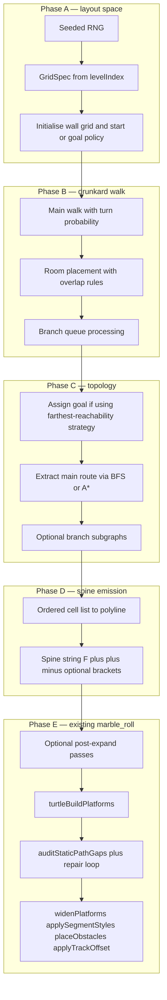

# Procedural level generation — drunkard grid layout (specification)

**Document type:** technical specification (target implementation)  
**Code:** intended home `game/procgen/` (new modules) orchestrated by `generateProcgenDescriptor.js`  
**Status:** **implemented** — `generateProcgenDescriptor` runs `procgenRng.js`, `gridSpec.js`, `drunkardGrid.js`, `gridTopology.js`, `gridToSpine.js`, `gridSpinePipeline.js`, then the existing turtle and post-process chain.

**Related documents**

| Document | Role |
|----------|------|
| [PROCEDURAL_L_SYSTEM_LEVELS.md](PROCEDURAL_L_SYSTEM_LEVELS.md) | Current spine → turtle → post-process contract and alphabet |
| [LEVEL_DESIGN_AND_PROCEDURE.md](LEVEL_DESIGN_AND_PROCEDURE.md) | Skills, affordances, MVP scope, design goals |
| [PROCGEN_COMPTON_MATEAS.md](PROCGEN_COMPTON_MATEAS.md) | Rhythm, repetition, connectivity methodology; complements this layout spec |

---

## 1. Purpose

Replace **only the implementation that chooses the course layout** (today: **motif concatenation** in `comptonRhythm.js` and/or **legacy L-system** expansion in `lSystemExpand.js`) with a **grid-first, drunkard-walk–style** generator that produces **readable** marble-course structure: **corridors**, **rooms (plazas)**, **controlled turns**, **optional branches**, and **guaranteed connectivity** along the **main route**.

**Non-goals for v1:** deleting legacy modules; full physics validation of every jump; gameplay features (gems, timers) beyond **hooks** in tile types.

**Unused modules:** `composeRhythmSpineString`, `expandLSystem`, and related files **remain** in the repository for reference and for the **`preserve/2d-side-runner`** branch; the main line generator does not call them.

---

## 2. Design principles

| Principle | Meaning for `marble_roll` |
|-----------|---------------------------|
| **Beatable 100% of the time** | Every tile on the **main route** must be reachable; optional branches must not block the goal or trap the player below the kill plane. |
| **Not entirely linear** | **Branch seeds** yield optional spurs (future gem routes, risky shortcuts) recorded in metadata; v1 may **flatten** the spine to **main only** (see §7.4). |
| **Human-readable** | **Low turn probability** in corridors, **axis-aligned rooms**, **non-overlapping** room placement where specified, width cues via existing **`applySegmentStyles`**. |
| **Marble Blast Gold–style cues** | **Wide start plaza**, **narrower runs**, **mid-course wider pads** (rooms), **clear finish**; ramps and verticality layered via existing post-passes or a later grid height layer. |

---

## 3. End-to-end pipeline (staged DAG)

Generation is a sequence of **immutable stages**; each stage consumes a typed artefact and produces the next. Randomness uses a **single seeded RNG** threaded through all stages (no bare `Math.random()`).



**Phases A–D** are the **new** layout backend. **Phase E** reuses the existing turtle, connectivity audit, and post-process chain; only **tuning** (which post-expand passes run, repair strategy) may change.

---

## 4. Suggested module architecture

| Module | Responsibility |
|--------|----------------|
| `procgen/rng.js` (or local helpers) | Deterministic **PRNG** (e.g. Mulberry32 or PCG) from `levelIndex` + per-phase **salt** strings |
| `procgen/gridSpec.js` | Derive **grid dimensions**, **walk budgets**, **`p_turn`**, **`p_room`**, **`p_branch`**, **room size bands** from `levelIndex` and `GameplaySettings.procgen` |
| `procgen/drunkardGrid.js` | Phases **A–B**: allocate tile grid, run walk, rooms, branch carving; output **`GridLayout`** |
| `procgen/gridTopology.js` | Phase **C**: build 4-connected graph on floor cells; **BFS**/**A*** main path **start → goal**; optional branch labelling |
| `procgen/gridToSpine.js` | Phase **D**: convert **ordered cell routes** to **turtle spine** (`F`, `+`, `-`, optional `^`/`v`/`r`, optional `[`/`]`) |
| `generateProcgenDescriptor.js` | **Orchestration**: select backend, call grid pipeline, pass **spine** into existing Phase **E** |

**Dependency rule:** layout modules must not depend on UI; keep imports aligned with existing `game/procgen/` ↔ `engine/procgen/` split if mirrored.

---

## 5. Data contracts

### 5.1 Tile enum (grid storage)

Stored in a compact array (e.g. `Uint8Array`), row-major indexing:

| Value | Meaning |
|-------|---------|
| `0` | Void / wall (uncarved) |
| `1` | Corridor floor |
| `2` | Room floor (carved rectangle) |
| `3` | Reserved: start marker (optional; may be metadata only) |
| `4` | Reserved: goal marker (optional; may be assigned in Phase C) |
| `5+` | Reserved for future hazards, gem slots, etc. |

**Height:** v1 may use a **single layer**. Multi-layer courses can add a parallel **`Int16Array`** of deck height per cell or separate **Z** slices; vertical variety may instead defer to **`applyLevelMapSplices`** and existing **`^`/`v`/`r`** passes.

### 5.2 `GridLayout` (Phase B output)

```ts
// Conceptual; JSDoc in implementation
{
  width: number,
  height: number,
  tiles: Uint8Array,
  startCell: { cx: number, cy: number },
  goalCell: { cx: number, cy: number } | null,
  branchSeeds: Array<{ cx: number, cy: number, dir: 0 | 1 | 2 | 3 }>,
  meta: {
    mainSteps: number,
    roomsPlaced: number,
    branchCarveSteps: number,
  },
}
```

### 5.3 `RoutePlan` (Phase C output)

```ts
{
  main: Array<{ cx: number, cy: number }>,
  branches: Array<{
    id: number,
    cells: Array<{ cx: number, cy: number }>,
    attachMainIndex: number,
  }>,
}
```

### 5.4 Spine and descriptor

- **Phase D** produces a **`string`** compatible with `turtleBuildPlatforms` (see [PROCEDURAL_L_SYSTEM_LEVELS.md](PROCEDURAL_L_SYSTEM_LEVELS.md) §4).
- The **level descriptor** shape returned by `generateProcgenDescriptor` remains unchanged: **`spawn`**, **`static`**, **`zones`**, **`killPlaneY`**, **`trackBaseY`**, **`procgenMeta`**.
- **`procgenMeta`** should be extended with **grid-specific** fields (grid size, room count, branch count, backend id, repair statistics) for QA and tuning.

---

## 6. Phase algorithms (normative detail)

### 6.1 Phase A — Grid initialisation

1. Compute **`gridW`**, **`gridH`** from `levelIndex` and config (e.g. monotonic growth with level bands).
2. Allocate **`tiles`**, fill with `0`.
3. Place **start**: choose **`startCell`** deterministically (e.g. edge mid, or hashed edge position with margin for room footprints).
4. **Goal policy** (pick one strategy and document in code):
   - **Strategy A:** Predefine a **goal region** (opposite edge) and **bias** the walk toward it; mark **`goalCell`** when the walk **enters** the region.
   - **Strategy B:** After carving, set **goal** to the **floor** cell that maximises **BFS distance** from **`startCell`** (deterministic tie-break, e.g. lexicographic `(cx, cy)`).

### 6.2 Phase B — Drunkard walk (Annunziato steps 1–2)

**Agent state:** `(cx, cy)`, facing **`dir ∈ {0,1,2,3}`** (define mapping to `(dx, dy)` consistently with Phase D emission).

For each step up to **`maxMainSteps`**:

1. **Carve** current cell (`1` or `2` if inside a room operation).
2. **Turn:** with probability **`p_turn`**, change **`dir`** (e.g. ±90° or random cardinal).
3. **Move:** compute neighbour; if **in bounds** and allowed, advance; if **blocked**, **resample** direction up to four attempts, then apply a **defined** fallback (stay, or bias toward **goal quadrant**).

### 6.3 Phase B — Rooms (steps 3–4)

On a **period** (every **R** steps) or with probability **`p_room`**:

1. Propose **room half-extents** **`(rw, rh)`** from config.
2. **Overlap test:** the axis-aligned rectangle must satisfy a **fixed** rule (e.g. ≥80% uncarved, or only overwrite corridor cells).
3. If the test fails, **defer** (corridor-only steps until the next attempt).
4. On success, set interior cells to **`2`**; optionally **enqueue branch seeds** at **doorway** cells (perimeter floor cells adjacent to `0`).

### 6.4 Phase B — Branching (step 5)

Maintain a **queue** of **`branchSeeds`**. When placing a room (or with probability **`p_branch`**), push seeds with an **exit direction**. After the **main** walk budget is exhausted, **drain** the queue with a **smaller** **`maxBranchSteps`** per seed. **Main** completion must **not** depend on branches.

### 6.5 Phase C — Topology

1. Build **4-connected** adjacency on all cells with **`tiles !== 0`** (or floor-only set).
2. Ensure **`goalCell`** is set per Phase A strategy.
3. Run **BFS** from **`startCell`** to **`goalCell`**; **reconstruct** **`main[]`**. If unreachable, this is a **generator bug** or **repair** trigger (extend carving — see §8).
4. **Branches:** for optional spurs, run **limited** BFS from each seed within carved tiles; discard disconnected junk or record for **`procgenMeta`** only.

### 6.6 Phase D — Grid to spine

1. **Scale:** fix **`cellWorld === step`** (turtle forward step from `GameplaySettings`) so **one grid step** corresponds to **one** `F` **when** the turtle yaw matches the grid edge direction.
2. **Yaw for grid:** grid turns are **90°**. Either set **`angleRad = π/2`** when **`layoutBackend === 'gridDrunkard'`** or emit **multiple** `+`/`−` symbols to match the existing per-level angle — the implementation should pick one approach and keep **determinism**.
3. Walk **`main[]`** in order; for each **edge** to the next cell, emit **`F`** for forward motion and **`+`/`−`** to align **yaw** to the next segment (see `lSystemTurtlePlatforms.js` for symbol semantics).
4. **Leading run-up:** if the turtle expects **N** forward symbols before the course “reads” like today, add **`leadingFCount`** from config.
5. **Vertical symbols:** v1 may **omit** `^`/`v`/`r` in emission and rely on **`applyLevelMapSplices`** / **`preferRampsOverStepJumps`** as today; v2 may map **stair** or **slope** tile tags to **`r`** / **`^`**.

---

## 7. Branches, turtle stack, and connectivity audit

The turtle implements **`[`** (push state) and **`]`** (pop state) — see `engine/procgen/lSystemTurtlePlatforms.js`.

**Issue:** `auditStaticPathGaps` checks **consecutive** box pairs in **`staticEntries` emission order**. Inserting **branch** geometry **between** main-route segments can distort **pairwise** gaps along the **logical** main path.

**v1 recommendation:** emit **main-route spine only**; store **branch** cell lists in **`procgenMeta`** for future obstacles or gems. **v2:** bracketed spines **or** a **main-path-only** audit pass — requires design change to the audit or emission order.

---

## 8. Integration with `generateProcgenDescriptor`

1. **Select backend** via settings (e.g. `layoutBackend`).
2. **Legacy path:** unchanged — `composeRhythmSpineString` and/or `expandLSystem`, then existing post-expand → turtle → audit → post-process.
3. **Grid path:** `spine = gridPipeline(levelIndex)` → **optional** `ensureTurnBudget` / `ensureVerticalBudget` / `preferRampsOverStepJumps` / `applyLevelMapSplices` (tune so grid layouts are not **over-modified**).
4. **Repair loop:** on **`auditStaticPathGaps` failure**, prefer **extending the grid carving** (more corridor cells toward connectivity) before blindly appending **`F`** to the **core** string; cap retries per **`comptonRhythmRepairMaxPasses`** or a grid-specific cap.

---

## 9. Configuration surface (`GameplaySettings.procgen`)

Introduce a **nested** `grid` (or equivalent) namespace, for example:

| Key | Purpose |
|-----|---------|
| `grid.widthMin` / `grid.widthMax` | Grid size bands |
| `grid.heightMin` / `grid.heightMax` | Grid size bands |
| `grid.pTurn` | Turn probability per step |
| `grid.pRoom` | Room attempt probability or period |
| `grid.pBranch` | Branch seed probability |
| `grid.mainStepsBase` | Walk length scaling with `levelIndex` |
| `grid.roomSizeMin` / `grid.roomSizeMax` | Room footprints |
| `grid.branchStepsMax` | Cap per branch carve |
| `gridToSpine.leadingFCount` | Run-up tiles |
| `gridToSpine.useRightAngle` | Force **90°** turtle turns for grid |

Exact names and defaults belong in `GameplaySettings.js` when implemented.

---

## 10. Testing strategy

| Unit | Assertions |
|------|------------|
| RNG | Same `levelIndex` + salt → identical stream |
| `drunkardGrid` | All carved cells form one **4-connected** component containing **start** |
| `gridTopology` | **`main`** is a valid path from **start** to **goal** |
| `gridToSpine` | Turtle **main-only** run covers expected **cell** count modulo start plaza |
| Integration | **`auditStaticPathGaps`** passes or repair terminates within cap; descriptor loads in **`LevelLoader.build`** |

---

## 11. Relation to Compton & Mateas and rhythm

[PROCGEN_COMPTON_MATEAS.md](PROCGEN_COMPTON_MATEAS.md) remains the **methodology** for **rhythm**, **repetition**, and **affordances**. This spec replaces **how** the **spine** is born (grid drunkard walk + rooms + branches), **not** the obligation to keep **connectivity** and **readable** pacing. Future work can attach **motif libraries** to **room sizes** or **corridor runs** so **rhythm** becomes **first-class** on top of the grid.

---

## 12. Migration checklist (implementation order)

1. Add **`layoutBackend`** (or equivalent) with **default** `legacyRhythm` until the grid path is verified; then flip default to **`gridDrunkard`** when ready.
2. Implement **Phases A–B** (single-layer floor, no rooms) + **Phase C–D** (BFS main path, **main-only** spine) + wire through **Phase E**.
3. Add **rooms** and **overlap** rules; tune **`p_turn`** vs corridor length.
4. Add **branch** carving and **`procgenMeta`**; keep **spine main-only** until audit story is resolved.
5. Re-tune **post-expand** passes for grid-born strings.
6. Update [PROCEDURAL_L_SYSTEM_LEVELS.md](PROCEDURAL_L_SYSTEM_LEVELS.md) §2 pipeline diagram and backend bullet to reference this document.

---

## 13. References (external)

- Annunziato, S. — *Procedural Level Generation* (drunkard walk, containment, rooms, non-overlap, branching) — blog article cited in project discussion; implementation here is **inspired by** that stepwise recipe, not a port of external code.
- Compton & Mateas (2006) — see [PROCGEN_COMPTON_MATEAS.md](PROCGEN_COMPTON_MATEAS.md).

---

## 14. Revision history

| Version | Date | Notes |
|---------|------|-------|
| 1 | 2026-04-01 | Initial specification: architecture, phases, data contracts, integration, testing |
