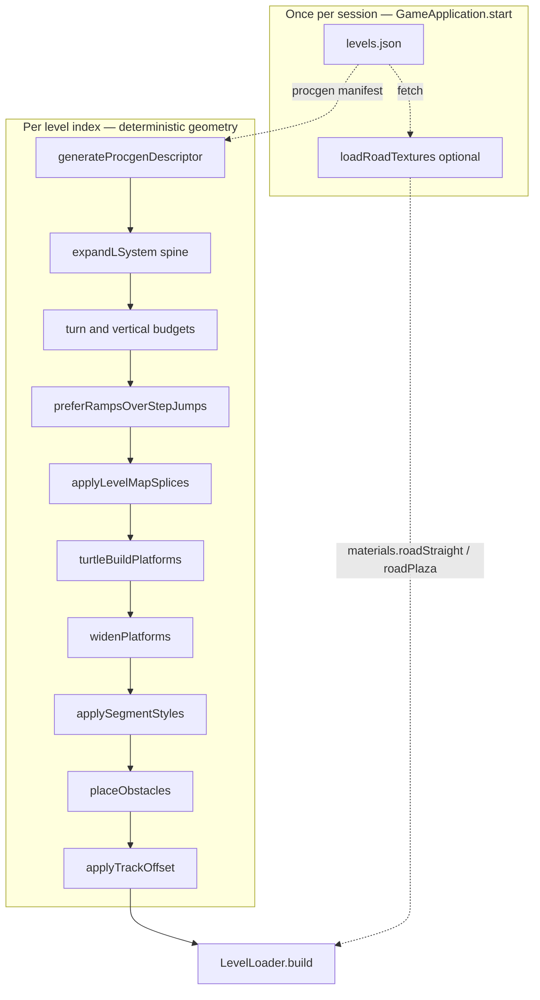

# Procedural level generation — L-system specification

**Document type:** technical specification  
**Code:** `game/procgen/` in the `marble_roll` project  
**Status:** The **full pipeline** in §2 (expand **main spine** → budgets → **`preferRampsOverStepJumps`** → **`applyLevelMapSplices`** → turtle → widen → **`applySegmentStyles`** → obstacles → offset) is **implemented** and **normative**. **§§3.4–3.7** (turn budget, vertical budget, ramp preference, **level-map splices**), **§4** (turtle alphabet including **`r`**), **§§5.1–5.7** (widths, zones, descriptor, **`trackBaseY`**, obstacles), **`procgenMeta`** (§5.4), and **§5.8** (road presentation in `LevelLoader`, optional textures) are **normative** for compatibility and QA replays.

---

## 1. Purpose

Levels are **not** authored as static JSON geometry for the main run. Each rung is **generated at load time** from a **parallel L-system** (string rewriting) that first defines a **single main forward path** (a **spine** — no **`[` / `]`** branches in the shipped rule set): a continuous centreline that **curves** like a marble course via turns and ramps. After budgets and ramp preference, a **splice** pass (**§3.7**) may, on rungs **`levelIndex ≥ 1`**, insert bursts of **`^`** or **`v`** so the **remainder** of the path shifts **up or down** by roughly **one jump’s vertical clearance** at each gap. A **turtle** then lays **horizontal tiles**, **sloped ramps** (`r`), and **height changes** (`^` / `v`), with **start** and **end** touch zones at the path extremities. Post-stages assign **deterministic** widths and **`materialKey`** labels (**`plaza`**, **`path`**, **`pathWide`**, **`ramp`**) so `LevelLoader` can style segments. **Geometry and physics** come only from the descriptor; **presentation** is either **diffuse-mapped road tops** (when textures load) or **flat `MeshStandardMaterial` colours** (fallback) — see §5.8.

This document specifies the **L formula** (axiom, production rules, iterations), **post-expansion string passes**, the **turtle alphabet**, numerical parameters, **budgets**, **segment styling**, **obstacles**, **`trackBaseY`**, the **level descriptor** contract for `LevelLoader.build`, and how **`materialKey`** maps to **visuals** without changing the procgen contract.

---

## 2. Pipeline overview

Generation is a **staged pipeline**. Stages after the turtle may reorder, widen, offset, or punch holes in geometry while preserving **determinism** from `levelIndex` (and fixed code).

**Bootstrap vs procgen:** **`loadRoadTextures`** runs **once** after the manifest is fetched; it does **not** read the L-string and does **not** affect **`generateProcgenDescriptor`**. It only populates optional **`THREE.Texture`** references on the materials object passed into **`LevelLoader.build`**. If loading fails, **`roadStraight`** is absent and §5.8 fallback applies.

1. **`levels.json`** supplies `levelCount`, `levelNames`, and `procgen: true` (read before first level; same fetch is the entry point for the procgen pipeline below).
2. **`expandLSystem`** produces the expanded symbol string from the axiom and **non-branching** spine rules (§3.2) — one **main forward** route to the finish.
3. **Budget passes** (§§3.4–3.5) may **append** **`+`/`-`** and **`r`** symbols so **turn** and **vertical** minimums are met **deterministically**.
4. **`preferRampsOverStepJumps`** may rewrite many **`^F`** pairs into **`r`** (sloped ramp) for a clearer **floating-course** read.
5. **`applyLevelMapSplices`** (§3.7) **does nothing** on **`levelIndex === 0`**. On later rungs it inserts **`^`** / **`v`** bursts so the **tail** of the path shifts vertically by ~**jump clearance** at each **splice site** (platforms are built on the resulting polyline in §4).
6. **`turtleBuildPlatforms`** emits flat tiles, **ramps** (`r`), and **per-tile elevation** from **`^`** / **`v`** (see §4–5).
7. **`widenPlatforms`** (normative) enforces §5.1; **ramps** widen only **cross-path** half-extent so slope length is not distorted.
8. **`applySegmentStyles`** assigns **deterministic** half-extents and **`materialKey`** (`plaza` / `path` / `pathWide` / `ramp`) for a wide start pad and narrower runs.
9. **`placeObstacles`** (normative) inserts **1–2 obstacle sites** per level (§5.6); obstacle hashes may use the **spine** string length **before** splices for stable indexing against the forward path.
10. **`applyTrackOffset`** (normative) adds a per-level **`trackBaseY`** to all platform centres, zones, and spawn (§5.7).
11. **`LevelLoader.build`** instantiates physics and visuals from the final descriptor (§5.8 maps **`materialKey`** to materials or textured faces).

**Source modules (for traceability):**

| Stage | Module |
|--------|--------|
| Expand | `lSystemExpand.js` |
| Turn / vertical budgets, **`preferRampsOverStepJumps`**, **`applyLevelMapSplices`** | `lSystemPostExpand.js` |
| Turtle + ramp box helper | `lSystemTurtlePlatforms.js`, `rampOrientation.js` |
| Widen, segment styles, obstacles, offset, kill plane | `postProcessProcgen.js` |
| Path width decay, procgen gameplay tuning | `GameplaySettings.js` |
| Orchestration | `generateProcgenDescriptor.js` |
| Road diffuse load (bootstrap) | `loadRoadTextures.js` |
| Static mesh + body build, §5.8 presentation | `LevelLoader.js` |

---

## 3. L-system (parallel rewriting)

### 3.1 Mechanism

- **Axiom:** initial string. Implementation uses **`F`**.
- **Production rules:** a map from **single-character predecessors** to **replacement strings**. Only **`F`** is rewritten; all other symbols are **terminal** and pass through unchanged when no rule exists.
- **Parallel rewriting:** each generation replaces **every** character in the string **simultaneously** according to the rules (standard L-system step).
- **Iterations:** the expansion is applied a fixed number of times **`n`**, with **`n = min(2 + min(levelIndex, 3), 4)`** (so between **2** and **4** inclusive).
- **Length cap:** expansion may be **truncated** at **120 000** characters to bound memory and frame time (`expandLSystem` `maxLength` option).

### 3.2 Rule sets per level (main spine — no branching)

Rules are **deterministic** from **`levelIndex`**. One of **eight** fixed **non-branching** productions is selected by **`levelIndex % 8`**. Replacements use **only** **`F`**, **`r`**, **`+`**, **`-`**, and (where present) **`^`** — **no** **`[`** / **`]`** — so the expanded string is a **single** continuous route from start to finish, winding in plan view like a marble track.

| Variant | Rule for `F` |
|--------|----------------|
| 0 | `FrFF+F` |
| 1 | `FFrF-F` |
| 2 | `F+F+rFF` |
| 3 | `FrF+F-F` |
| 4 | `FF+rFF` |
| 5 | `Fr+F-FF` |
| 6 | `F+rFrF` |
| 7 | `FFr+F-F` |

Each variant mixes **`r`** (ramp), **`F`**, and **turns** so the **main path** curves without alternate branches. **`[`** / **`]`** remain in the turtle alphabet (§4) for compatibility but **do not** appear in the shipped spine expansions.

### 3.3 Level-scaled angles and step

After expansion, the turtle uses:

| Parameter | Formula / notes |
|-----------|------------------|
| **Branch angle** | `angleDeg = 32 + (levelIndex % 7) * 3` (degrees), converted to radians — **tighter** corners than gentle arcs |
| **Step length** | `step = 2.1 + levelIndex * 0.08` (world units per `F` or `G`) |
| **Vertical step** | `verticalStep` (e.g. **0.38** world units per **`^`** / **`v`**) — must stay within plausible jump height for the marble |

These change the **geometry** without changing the **discrete** L-string (same symbol sequence for a given variant and iteration count).

### 3.4 Turn budget per level (normative)

A **turn** (for counting purposes) is **one** turtle execution of **`+`** or **`-`** (each symbol increments the turn budget by one). Branches (**`[` / `]`**) may create additional path complexity; the **minimum** below applies to the **expanded string** before the turtle runs.

Let **`turnSymbols(s)`** be the number of **`+`** and **`-`** characters in string **`s`**.

**Minimum turn count** after L-system expansion (and before any turn injection — see below):

| `levelIndex` | Minimum `turnSymbols(s)` |
|----------------|---------------------------|
| **0** (first level) | **≥ 1** |
| **1** | **≥ 1** |
| **2, 3** | **≥ 2** |
| **4, 5** | **≥ 3** |
| … | **≥ `1 + ⌊levelIndex / 2⌋`** |

So the **first** rung always includes **at least one** deliberate direction change, and the required minimum **rises every two** indices (an extra turn **every other** level step).

**If** the expanded string from §3.1–3.2 alone would yield **`turnSymbols(s) < minTurnCount(levelIndex)`**, the implementation shall **deterministically** satisfy the shortfall — for example by **appending** a suffix of **`+`** / **`-`** symbols derived from **`levelIndex`** and **`expandedLength`** (e.g. alternate **`+-`** or repeat **`+`**), then passing the result to the turtle. Injection must be **reproducible** and must not use runtime randomness.

**Note:** Raising **iterations** (§3.1) or choosing **rule variants** with more **`+`/`-`** may already meet the budget; injection is a **fallback** to guarantee the floor.

### 3.5 Vertical jump budget per level (normative)

A **vertical step symbol** is **`^`** (raise without moving) or **`r`** (ramp: forward **`step`** and rise **`verticalStep`** in one sloped segment). Let **`verticalSymbols(s)`** be the count of **`^`** plus **`r`** in **`s`**.

**Minimum** **`verticalSymbols(s)`** after expansion and before the turtle runs:

| `levelIndex` | Minimum |
|----------------|----------|
| **0** | **≥ 1** |
| **1, 2** | **≥ 1** |
| **3–5** | **≥ 2** |
| **6–8** | **≥ 3** |
| … | **≥ `max(1, 1 + ⌊levelIndex / 3⌋)`** |

If the expanded string (§3.1–3.2) plus §3.4 turn injection still has **`verticalSymbols(s) < minVertical(levelIndex)`**, the implementation shall **deterministically** append **`r`** as needed (one **`r`** per shortfall). Injection must be **reproducible** (e.g. derived from **`levelIndex`** and string length), not from runtime randomness.

**Optional `v`:** **`v`** lowers the deck by **`verticalStep`**, clamped to the **baseline** platform centre **`y = -hy`** so the path cannot fall arbitrarily far below the origin pad.

**Order of operations:** **`ensureTurnBudget`** runs first, then **`ensureVerticalBudget`**, then **`preferRampsOverStepJumps`** (§3.6), then **`applyLevelMapSplices`** (§3.7). Budgets apply to the string **before** splices; **`procgenMeta`** symbol counts (§5.4) use the **final** expanded string **after** all passes including splices.

### 3.6 `preferRampsOverStepJumps` (normative)

After §§3.4–3.5, the implementation scans the string and may replace each adjacent pair **`^F`** with a single **`r`**:

- For each index **`i`** where **`s[i] === '^'`** and **`s[i+1] === 'F'`**, let  
  **`h = ((levelIndex * 1315423911 + i * 17 + length(s)) >>> 0) % 3`**.  
- If **`h !== 0`**, emit **`r`** and skip both characters; otherwise emit **`^`** and continue (so roughly **two thirds** of **`^F`** pairs become ramps, **one third** stay as step + forward tile).

This pass runs **after** vertical budgeting so **`^F`** patterns from rules or injection can be converted without changing the **endpoint** of that step (ramp **`r`** matches the same net displacement as **`^F`**).

### 3.7 `applyLevelMapSplices` (normative)

After the **main spine** string is fixed (§3.2) and passes §§3.4–3.6, this stage adjusts **relative height** along the route so later rungs introduce **jump-scale** discontinuities along a **single** forward path.

- **`levelIndex === 0` (first rung):** implementation returns the string **unchanged** — **no** splices.
- **`levelIndex ≥ 1`:** at up to **`min(levelIndex, 10, …)`** **splice sites** (deterministic, with minimum spacing along the string), insert either **`^`** repeated **`stepsPerSplice`** times **or** **`v`** repeated **`stepsPerSplice`** times, chosen by a fixed hash of **`levelIndex`** and the insertion index. **`stepsPerSplice`** is derived from **`jumpClearance`** and **`verticalStep`**:  
  **`stepsPerSplice = clamp(round(jumpClearance / verticalStep), 2, 8)`**  
  with **`jumpClearance`** (e.g. **0.92** world units) chosen so the cumulative **`^`** / **`v`** shift is on the order of **one marble jump** relative to **`verticalStep`** (see also **`ControlSettings.marble.jumpImpulse`** in code).
- **Effect:** each insertion raises or lowers the turtle’s **current deck height** before the rest of the string is interpreted, so **everything after** that point is built **higher or lower** — a **gap** in the sense of **vertical separation** the player must clear by jumping (in addition to any horizontal gaps from §5.6).
- **Candidates:** splice positions are indices **after** a completed **`F`** or **`r`** symbol, restricted to the **middle** of the string (implementation uses roughly **12%–88%** of length) so splices do not sit on the spawn or goal pads.

**Determinism:** only **`levelIndex`**, **`verticalStep`**, **`jumpClearance`**, and the **pre-splice** string determine splice sites and up/down choice — **no** runtime randomness.

---

## 4. Turtle interpretation (geometry alphabet) and turns

The expanded string is scanned **left to right**. State: position **`(x, z)`**, **platform centre `y`**, **yaw** (radians, rotation about **+Y**), and a **stack** for branches.

| Symbol | Meaning |
|--------|---------|
| **`F`**, **`G`** | Advance **`step`** in the current yaw: `x += step * sin(yaw)`, `z += step * cos(yaw)`. Place a **platform box** centred at **`(x, y, z)`** with half-extents **`(hw, hy, hw)`** before widening (see §5.1). |
| **`r`** | One **sloped** box along displacement **`(dx, dy, dz) = (step·sin(yaw), verticalStep, step·cos(yaw))`**. Centre at the chord midpoint **`(x+dx/2, y+dy/2, z+dz/2)`**; half-extents **`[hw, hy, L/2]`** in local axes with local **+Z** along the slope; orientation from **`Euler(pitch, yaw, 0, 'YXZ')`** with **`pitch = -atan2(dy, hypot(dx,dz))`** (see **`rampOrientation.js`** / **`buildRampBox`**). Then **`x += dx`**, **`z += dz`**, **`y += dy`**. Same net endpoint as **`^F`**. |
| **`^`** | **`y += verticalStep`** without moving horizontally (next **`F`** places higher — **step-up** or jump). |
| **`v`** | **`y = max(-hy, y - verticalStep)`** (optional descent, clamped to baseline). |
| **`+`** | `yaw += angleRad` (**turn left** in plan view). |
| **`-`** | `yaw -= angleRad` (**turn right** in plan view). |
| **`[`** | Push **`{ x, z, yaw, y }`** onto the stack. |
| **`]`** | Pop and restore **`x, z, yaw, y`**. |
| **Other characters** | Ignored (no geometry). |

**Turns:** Course **direction changes** come entirely from **`+`** and **`-`** after each expansion. **Branches** (**`[` / `]`**) may create **alternative routes** in general; the **shipped spine** (§3.2) does **not** emit them, so the player follows **one** main forward line. Tuning **`angleDeg`** and **`step`** changes how **tight** corners feel without altering the discrete string.

**Turn budget:** The expanded string **before §3.7** (after any **deterministic** suffix required by §3.4) shall contain **at least** the minimum number of **`+`/`-`** symbols for that **`levelIndex`**. Splices add **no** turn symbols.

**Vertical budget:** The string **before §3.7** (after §3.5 injection if needed) shall meet **`verticalSymbols`** minimums above. The **final** string passed to the turtle **includes** splice **`^`** / **`v`** symbols (§3.7).

**Initial state:** before parsing, an **origin platform** is placed at **`(0, -hy, 0)`** so the spawn sits on a tile. The turtle starts at **`(0, 0)`** in XZ with **`y = -hy`** and **`yaw = 0`** (forward **+Z** in XZ).

**End zone height:** the **goal** zone’s **`Y`** shall match the **top surface** of the **last** turtle-emitted tile: **`y + hy`** (before **`trackBaseY`**), so the marble can register the goal on a raised finish pad.

**Reference:** L-systems and architectural interpretations; see [Michael Hansmeyer — L-systems](https://michael-hansmeyer.com/l-systems.html). The shipped generator uses a **non-branching** spine plus **splices** (§3.7) instead of parallel branches for the main route.

---

## 5. Platform geometry, zones, obstacles, and vertical shift

### 5.1 Platforms, minimum width, and segment styling

- Each solid is a **box** collider and mesh (`type: 'box'`). Turtle baseline: **`platformHalfExtentXZ = 1.05`**, **`platformHalfExtentY = hy`** (e.g. **0.22**).
- **Path width** uses **`GameplaySettings.js`**: **`procgenPathHalfXZBase(levelIndex)`** interpolates from an **early bonus** down to **`pathPlatformHalfXZFloor`** (slightly under the legacy **1.2** minimum) over **`pathPlatformWidthDecayLevels`** rungs (smoothstep). Per-tile width is **`base + span`** with the same deterministic **`span`** hash as before (see **`pathHalfXZSpan*`** in settings).
- **Export** **`MIN_PLATFORM_HALF_XZ`** in **`postProcessProcgen.js`** equals **`GameplaySettings.procgen.pathPlatformHalfXZFloor`** (late-run floor). After **`widenPlatforms(staticEntries, levelIndex)`**, tiles use **`hx, hz ≥ procgenMinPlatformHalfXZ(levelIndex)`**. **Ramps:** only **`hx`** is raised to that minimum; **`hz`** stays **half the slope length** **`L/2`**.
- **`applySegmentStyles`** (runs **after** widen) sets final **XZ** half-extents and **`materialKey`**:
  - **Index 0** (spawn pad): **`plazaHalfXZ`** from settings (e.g. **2.35**), **`materialKey: 'plaza'`**.
  - **Other horizontal tiles:** **`w`** as above. Occasional boosted strips use **`pathWideDelta`** / **`pathWideCap`**. **`pathWide`** material when **`wide > procgenPathHalfXZBase(levelIndex) + pathWideOverBase`**.
  - **Ramps:** cross-path half-width **`max(procgenMinPlatformHalfXZ(levelIndex), w)`**; **`materialKey`** remains **`'ramp'`**.
- **`LevelLoader.build`** maps **`materialKey`** to **visuals** (§5.8); **`lattice`** entries keep the lattice material when **`lattice: true`**.
- After **`applyTrackOffset`**, walkable tops are **`y_tile + hy + trackBaseY`** (variable **`y_tile`**).

There is **no** separate global safety floor under the map; only **tile** geometry (plus obstacle rules) exists.

### 5.8 Road presentation (`LevelLoader` + optional textures)

**Scope:** **Rendering only.** Cannon-es **`Box`** shapes, descriptor **`halfExtents`**, **`position`**, **`quaternion`**, and **`materialKey`** semantics are **unchanged** by this layer. Missing or failed texture loads **do not** alter procgen output — they only change whether boxes use **solid segment materials** or **textured tops**.

**Assets (minimal runtime set):** diffuse images under **`marble_roll/assets/road/`**, currently **`Road1_B.png`** (straight / path / ramp tops) and **`Road6_B.png`** (spawn **`plaza`** top). These align with the modular road pack’s straight and end-cap atlases; the full **`obj`/`dae`** catalogue is **not** required for the floating-course boxes.

**Bootstrap:** **`GameApplication.start`** calls **`loadRoadTextures()`** after **`levels.json`** resolves. On success, **`materials.roadStraight`** and **`materials.roadPlaza`** are set on the shared materials object. On failure, a **warning** is logged and those keys stay **undefined** (flat colours).

**Mapping `materialKey` → texture choice:**

| `materialKey` | Top-face diffuse source |
|---------------|-------------------------|
| **`plaza`** | **`roadPlaza`** (falls back to **`roadStraight`** if plaza texture missing) |
| **`path`**, **`pathWide`** | **`roadStraight`** |
| **`ramp`** | **`roadStraight`**, with a **light green colour multiply** on the top **`MeshStandardMaterial`** for readability |

**Mesh construction:** When **`roadStraight`** is present, each **non-lattice** box uses a **six-material** **`BoxGeometry`** (Three.js face order: **+X, −X, +Y, −Y, +Z, −Z**). The **+Y** face is the **walkable top in mesh space**; it receives a **clone** of the chosen diffuse with **`repeat`** set from tile size **`(2·hx, 2·hz)`** and a fixed **authoring span** of **12** world units per texture tile (**`ROAD_TEXTURE_TILE_UNITS`**), matching the straight road mesh scale in the source pack. **Side** faces use a dark solid material (varies slightly by segment type). **`lattice`** tiles skip road mapping and use the wireframe lattice material.

**Lifecycle:** On **`LevelLoader.clear`**, per-mesh **cloned** texture instances attached to materials are **disposed** with the mesh. Base textures loaded at bootstrap persist for the session.

**Determinism:** Texture availability does **not** affect §6 — same **`levelIndex`** yields the same descriptor and physics whether or not road PNGs loaded.

### 5.2 Start and end zones

- **Start zone:** flat disc at **`(0, zoneSurfaceY + trackBaseY, 0)`** (see §5.7), **`zoneRadius = 0.62`**, **`zoneSurfaceY = 0.04`** relative to track top convention.
- **End zone:** same radius at the **final turtle position** **`(x, z)`**, **`Y`** at the **last tile top** (§4), not a fixed planar height when the finish is raised.

Gameplay logic requires **touching the start zone** before **the end zone** can complete the level.

### 5.3 Spawn and fall bound

- **Spawn:** **`[0, marbleLift + trackBaseY, 0]`** with **`marbleLift`** chosen so the marble clears the first tile (e.g. **0.55** above local deck).
- **`killPlaneY`:** shall lie **below** the lowest walkable / colliding surface for that rung (including **`trackBaseY`**), with margin (e.g. **`minY - 4`** from combined static bounds after obstacles and offset).

### 5.4 Descriptor output

`generateProcgenDescriptor` returns an object compatible with **`LevelLoader.build`**, including at least:

- **`id`**, **`displayName`**, **`spawn`**, **`static`**, **`zones: { start, end }`**, **`killPlaneY`**, **`trackBaseY`** (same value passed into offset; useful for UI or debugging)
- **`static[]` entries** (boxes): **`type`**, **`halfExtents`**, **`position`**, **`quaternion`** (axis-angle **`[x,y,z,w]`**, default identity for flat tiles), optional **`collision: false`** (lattice), optional **`lattice: true`**, optional **`materialKey`** (`'plaza' | 'path' | 'pathWide' | 'ramp'`)
- **`procgenMeta`:** **`iterations`**, **`angleDeg`**, **`step`**, **`verticalStep`**, **`jumpClearance`**, **`mainPathSpine: true`**, **`expandedLength`** (final string **after** §§3.4–3.7), **`expandedLengthBeforeSplices`**, **`spliceSiteCount`**, **`spliceVerticalStepsPerSite`** (0 on first rung), **`turnSymbolCount`**, **`minTurnCount`**, **`verticalSymbolCount`** (count of **`^`**, **`r`**, and **`v`** in the final string), **`minVerticalSymbolCount`**, **`obstacleSeeds`** with **`latticeIndex`**, **`gapIndex`**, **`obstacleCount`**

Symbol counts in **`procgenMeta`** reflect the **final** expanded L-string (after **`preferRampsOverStepJumps`** and **`applyLevelMapSplices`**).

---

### 5.5 Track vertical offset (`trackBaseY`)

- **Normative:** each rung applies a **global vertical translation** **`trackBaseY`** (world units) to **all** static box positions, **both zones**, and **spawn** (`applyTrackOffset`).
- **Implementation:** **`trackBaseY = (levelIndex % 5) * 0.35 - 0.7`** (`computeTrackBaseY`).
- **Obstacles** (§5.6) are chosen from tile indices **before** offset; geometry is shifted with everything else.

---

### 5.6 Obstacles (normative)

Each procedural level shall include **at least one** and **at most two** **obstacle sites**, chosen **deterministically** from **`levelIndex`**, rule **variant**, and a digest of the **expanded string length** (or tile index list), so QA and replays reproduce layouts.

| Type | Description |
|------|-------------|
| **Lattice / missing floor** | A **span** along the path where **support is incomplete**: e.g. **no collider** under part of the deck, or a **perforated** region the marble can fall through if not careful. Visually may read as **lattice** or **open grid**. |
| **Jump gap** | A **deliberate gap** between platform centres **wider** than a normal **`step`**, requiring a **jump** (or high speed) to cross; implemented by **omitting** a collider between two valid approach tiles or by **offsetting** a segment vertically with empty space. |

**Placement:** obstacles shall sit **on** the centreline path (or replace specific **tile indices**), not on arbitrary off-path coordinates, unless the generator explicitly adds spur geometry.

**Interaction with widen:** obstacle bounds must respect **minimum** tile width where a tile still exists; gaps **remove** or **shorten** support rather than shrinking **`hw`** below §5.1 on remaining solids.

---

## 6. Determinism and reproducibility

For a fixed **`levelIndex`** and unchanged code:

- The **rule variant**, **iteration count**, **`angleDeg`**, **`step`**, **`verticalStep`**, **`jumpClearance`**, and turtle baseline **`hw` / `hy`** are fixed.
- The **expanded string** after **§§3.4–3.7** (turn injection, vertical injection, **`preferRampsOverStepJumps`**, **`applyLevelMapSplices`**) is deterministic.
- **`applySegmentStyles`** widths and **`pathWide`** selection are deterministic functions of **`levelIndex`** and tile index.
- **`trackBaseY`**, **`widenPlatforms`**, and **`placeObstacles`** indices are deterministic functions of **`levelIndex`** and the **spine** string length **before splices** (and the static tile count implied by the turtle).

Changing **`maxLength`**, spine rule tables, axiom, **`applyLevelMapSplices`** parameters, turtle or **`buildRampBox`** semantics, **§3.4** / **§3.5** / **§3.6** / **§3.7** rules, **`verticalStep`**, **`jumpClearance`**, **`GameplaySettings.procgen`** path width fields, **`PLAZA_HALF_XZ`** / plaza export, segment-style hashes, **`preferRampsOverStepJumps`** constants, obstacle rules, or **`computeTrackBaseY`** **changes** the level layout and must be treated as a **compatibility break** for saved replays or QA baselines.

Changing **§5.8** texture filenames, **`ROAD_TEXTURE_TILE_UNITS`**, face-selection rules, or tint constants **changes visuals only**, not layout compatibility.

---

## 7. Relation to the game manifest

`levels/levels.json` uses **`schemaVersion: 2`**, **`procgen: true`**, **`levelCount`**, and **`levelNames`**. Individual levels are **not** stored as JSON arrays of boxes; the manifest only drives **how many** rungs exist and how they are **titled**.

---

## 8. Revision history

| Version | Date | Notes |
|---------|------|--------|
| 1 | 2026-03-30 | Initial spec for L-system procgen as implemented |
| 2 | 2026-03-30 | Turns documented; minimum platform width; pipeline stages (widen, obstacles, `trackBaseY`); obstacle types and counts; spawn / kill with vertical shift |
| 3 | 2026-03-30 | §3.4 normative **turn budget**: ≥1 turn on first level; minimum **`1 + ⌊levelIndex/2⌋`** turn symbols; deterministic injection if short; **`turnSymbolCount`** in descriptor meta |
| 4 | 2026-03-30 | **Vertical jumps**: turtle **`^`** / **`v`**, **`verticalStep`**, rule variants with **`^`**; §3.5 **vertical budget** and **`^F`** injection; end zone at last tile top; **`verticalSymbolCount`** / **`minVerticalSymbolCount`** in meta |
| 5 | 2026-03-30 | **Course look**: turtle **`r`** (sloped ramp), **`preferRampsOverStepJumps`**, **`applySegmentStyles`** (plaza / path / pathWide / ramp), tighter **`angleDeg`**, ramp-aware **widen**; flat **materialKey** colours in **`LevelLoader`** |
| 6 | 2026-03-30 | Spec sync: **status** and §1 purpose; **module table**; **§3.6** `preferRamps` formula; **§4** ramp maths; **§5.1** numeric segment rules; **§5.4** static schema + **`trackBaseY`**; **§5.5** `computeTrackBaseY`; **§6** determinism; remove stub pipeline note |
| 7 | 2026-03-29 | **§5.8** road presentation: **`loadRoadTextures`**, **`assets/road/`** PNGs, **`LevelLoader`** six-face boxes, bootstrap vs procgen in §2 diagram; §1 / §5.1 / §6 cross-links; module table rows |
| 8 | 2026-03-29 | **Main spine** (non-branching rules §3.2); **`applyLevelMapSplices`** §3.7; pipeline and **`procgenMeta`** updated; first rung unspliced |
| 9 | 2026-03-29 | **`GameplaySettings.js`**: level-scaled path width (early wider, decays to floor **1.08**); **`widenPlatforms(static, levelIndex)`**; §5.1 updated |
