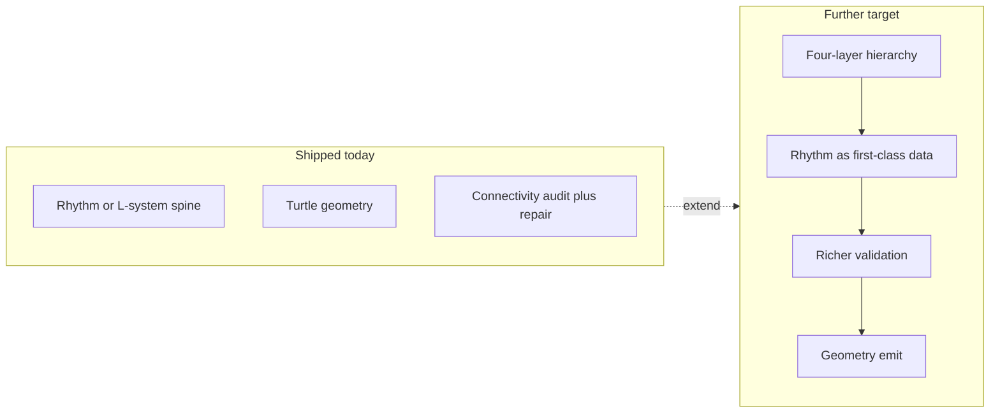

# Procedural level design — Compton & Mateas (target methodology)

**Document type:** design specification (normative for generator evolution)  
**Status:** **partially implemented** — motif **rhythm layer** (`game/procgen/comptonRhythm.js`), **connectivity audit** (`connectivityAudit.js`), and a **repair loop** in `generateProcgenDescriptor.js` are wired behind `GameplaySettings.procgen.useComptonRhythmLayer` (default **on**). The paper’s full **four-layer hierarchy** and deeper physics validation are **not** yet in code.  
**Companion:** [LEVEL_DESIGN_AND_PROCEDURE.md](LEVEL_DESIGN_AND_PROCEDURE.md), [PROCEDURAL_L_SYSTEM_LEVELS.md](PROCEDURAL_L_SYSTEM_LEVELS.md)

---

## 1. Source paper

Compton, K., & Mateas, M. (2006). *Procedural Level Design for Platform Games.* Proceedings of the Second AAAI Conference on Artificial Intelligence and Interactive Digital Entertainment (AIIDE), 2(1), 109–111.

- **DOI:** [10.1609/aiide.v2i1.18755](https://doi.org/10.1609/aiide.v2i1.18755)  
- **Open access PDF (AAAI):** [ojs.aaai.org … /view/18755/18531](https://ojs.aaai.org/index.php/AIIDE/article/view/18755/18531)  
- **Legacy UCSC PDF (Wayback):** [web.archive.org … compton-aiide2006.pdf](https://web.archive.org/web/20120531214939/http://users.soe.ucsc.edu/~michaelm/publications/compton-aiide2006.pdf)

The paper argues that platformers need **tighter relational structure** than dungeon or terrain generators: small geometric changes (e.g. chasm width) can make a course **impossible** rather than merely harder. It proposes a **four-layer hierarchical representation** of levels, emphasising **repetition**, **rhythm**, and **connectivity**, and a generation approach built on that model. The hierarchy is informed by **musical rhythm theory** (rhythmic structure in African and African-American musics), because platform play depends on **timing** and **flow** as much as spacing.

**Implementers:** read the PDF for precise layer definitions, grammar, and the generation algorithm; this document records *project* adoption and *mapping*, not a substitute for the paper.

---

## 2. Design principles we adopt

| Principle | Meaning for `marble_roll` |
|-----------|---------------------------|
| **Rhythm** | Sequences of actions (roll, brake, jump, gap) form **patterns** with tempo; difficulty scales by varying rhythm, not only tile noise. |
| **Repetition** | Reusable **motifs** (short platform phrases, obstacle pairings) recur at controlled intervals — familiar chunks, not purely random symbols. |
| **Connectivity** | The course is a **structured graph or ordered path** with explicit transitions; every segment must be **reachable** under marble physics ([`ControlSettings`](../../game/config/ControlSettings.js), [`PhysicsSystem`](../../game/systems/PhysicsSystem.js)). |
| **Playability constraints** | Geometry is validated against affordances (see [LEVEL_DESIGN_AND_PROCEDURE.md §3](LEVEL_DESIGN_AND_PROCEDURE.md)) before commit — aligned with the paper’s stress on **fragile** platform feasibility. |

---

## 3. Relation to the current implementation

The shipped pipeline ([PROCEDURAL_L_SYSTEM_LEVELS.md](PROCEDURAL_L_SYSTEM_LEVELS.md)) builds the **main spine** either from **motif concatenation** (default) or **legacy L-system expansion**, then runs the same post-passes (budgets, splices, turtle, widen, obstacles). **Connectivity** is checked on **consecutive** turtle-emitted boxes (XZ centre distance vs `step × connectivityMaxGapFactor`); failed audits append forward symbols and rebuild up to `comptonRhythmRepairMaxPasses`.

Still **not** explicit in code versus the paper:

- a **four-layer** hierarchy as in the paper,
- **musical** rhythm units as structured data beyond string concatenation,
- **chunk libraries** with full authored connectivity guarantees,
- a **physics gym** for jump/roll validation on every transition.

---

## 4. Migration outline (roadmap)

Incremental work so levels remain playable:

1. **Extract motifs** — recurring patterns in turtle output inform the **motif library** in `comptonRhythm.js` (started from former spine rule fragments).
2. **Rhythm layer** — **done (v1):** `composeRhythmSpineString(levelIndex)` concatenates motifs; measure count scales with `procgenLSystemIterations` bands.
3. **Connectivity checks** — **done (v1):** XZ gap audit on consecutive boxes + append-`F` repair loop; **not** yet full physics affordance checks.
4. **L-system** — **optional:** set `useComptonRhythmLayer: false` to use the previous `expandLSystem` path (`legacyLSystemMaxLength` cap).

[`GameplaySettings.procgen`](../../game/config/GameplaySettings.js) holds the new flags and thresholds; [`AssetSettings`](../../game/config/AssetSettings.js) is unchanged by this stage.

---

## 5. Revision history

| Version | Date | Notes |
|---------|------|--------|
| 1 | 2026-03-30 | Initial adoption doc; links to Compton & Mateas 2006; migration outline |
| 2 | 2026-03-30 | Rhythm layer, connectivity audit, repair loop; status → partially implemented |
