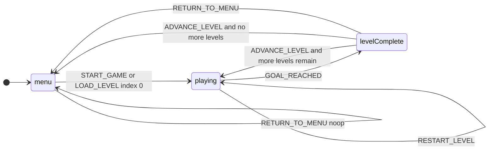
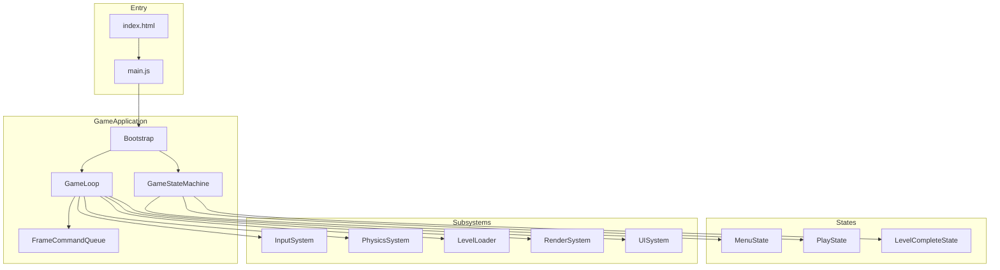

# Marble Blast HTML — technical specification

**Document status:** draft for MVP implementation  
**Schema version:** `1` (see [Level bundle schema](#3-level-bundle-schema))

This document is the behavioural and data contract for the HTML-only Marble Blast–style prototype. Implementation should match it unless this spec is revised in version control.

---

## 1. Purpose

Deliver a **small-scale, Marble Blast Gold–inspired** browser game: a **3D marble** rolls under **rigid-body physics**, a **third-person camera** follows, and the player completes **levels** (implemented as **procedural courses**: a **non-branching L-system spine** to the goal, then optional **vertical splices** on later rungs — see `gen/docs/PROCEDURAL_L_SYSTEM_LEVELS.md`) driven by `levels.json` by reaching **zones** / a **goal**. The product is **truly HTML-only**: static assets, **no** application bundler and **no** TypeScript compile step. **Track appearance** (optional diffuse textures for path segments) is a **presentation layer** on top of the level descriptor — see [§5.2.1](#521-track-presentation-procgen-aligned).

**Design intent vs implementation:** `gen/docs/LEVEL_DESIGN_AND_PROCEDURE.md` records **methodology** (skills, affordances, obstacle vocabulary, agency, roadmap). `gen/docs/PROCEDURAL_L_SYSTEM_LEVELS.md` remains the **normative implementation** spec for the **current** generator (`game/procgen/`). This technical spec does not duplicate those documents; it binds behaviour and data contracts.

This slice proves **architecture** (bootstrap, game loop, state machine, command queue, level loading) and **core gameplay**, not feature parity with the original title.

---

## 2. Technical constraints

| Constraint | Requirement |
|------------|----------------|
| Delivery | Static `index.html`, CSS, and JavaScript only. |
| Build | **None** required to run or ship (no Webpack, Vite, Rollup, etc.). |
| Types | **JavaScript** only at authoring time (no mandatory TS). |
| Entry | Exactly **one** root module referenced from `index.html` (e.g. `main.js`). Additional code is loaded via **ES module `import`** from that root, **not** via extra `<script>` tags that initialise the game. |
| Rendering | WebGL via **[Three.js](https://threejs.org/)** (ES module build). |
| Physics | **[cannon-es](https://github.com/pmndrs/cannon-es)** (pure JavaScript rigid bodies). |
| Libraries | Loaded through an **import map** in `index.html`, pointing either to a **CDN** or to **`vendor/`** copies for offline or pinned versions. |

### 2.1 Local development and deployment

- **Recommended:** serve the folder with any **static HTTP server** so ES modules and `fetch` of JSON levels resolve correctly. Opening `index.html` as `file://` may fail module or JSON loading depending on browser policy.
- **CORS:** level data and assets are same-origin when served statically.

### 2.2 Encapsulation

- Avoid polluting `window` except optional debug hooks.
- Initialise the game from the **single** entry module.
- future use may be possible to reuse everything in this file except the actual marble game (like game physics, subsystems, etc) so build with that in mind.

---

## 3. Player experience

1. **Launch:** the player sees a **start screen** (title, short instructions, primary call to action).
2. **Start:** **Enter** or a **visible control** (e.g. “Play” button) begins the run: **level 1** loads.
3. **Play:** **WASD** and/or **arrow keys** apply torque (or equivalent rolling input) to the marble. The camera follows in third person.
4. **Goal:** when the marble satisfies the **goal condition** (see [Goal](#35-goal)), the run **completes that level**.
5. **Next level:** after level 1, **level 2** loads automatically (or via an explicit “Continue” step—see [Level complete](#4-state-machine); this spec requires a clear transition and at least two levels in data).
6. **Restart:** during play, **R** (or an agreed alternate) **restarts the current level** (reset marble pose and velocities, clear transient win flags for that attempt).
7. **After the final level:** return to the **menu** (or a minimal “Thanks” screen that then returns to menu). **MVP:** after last level completion, transition to **menu** with session progress cleared or a simple message.

**Out of scope for MVP:** gems, timers, power-ups, multiplayer, audio beyond optional placeholders, mobile gyro, level editor.

---

## 3.1 Controls (normative)

| Action | Binding |
|--------|---------|
| Roll | **W**, **A**, **S**, **D** and/or **Arrow keys** |
| Restart level | **R** |
| Confirm menu / continue | **Enter** (where applicable) |

Implementations may add a clickable **Play** on the start screen and **Continue** on level complete if desired.

---

## 3.2 Start screen

- Visible on initial load and when returning from **menu** state after a completed run.
- Shows game title and basic instructions (movement, restart, goal).
- Hides or de-emphasises gameplay UI until **Start** is confirmed.

---

## 3.3 Goal

- Each level defines a **goal** as a **position** in world space and a **capture radius**.
- **Win condition:** distance from marble centre to goal centre is **≤** capture radius (plus marble radius if implementation uses combined radii—document in code comments; normative test is “overlap by distance check”).
- On win, enqueue **`GOAL_REACHED`** (see [Command catalogue](#6-command-catalogue)).

---

## 4. State machine

States are mutually exclusive: **one** active state drives gameplay logic per frame (menu may still run the render loop).

### 4.1 States

| ID | Name | Description |
|----|------|-------------|
| `menu` | Menu | Start screen; no physics gameplay updates (or physics paused/disabled). |
| `playing` | Playing | Active marble; physics stepping; input affects marble. |
| `levelComplete` | Level complete | Short beat after goal; offer **Continue** (or auto-advance after delay—implementation choice, but behaviour must match one of the options documented in code and summarised here). |

**Optional later:** `paused` — not required for MVP.

### 4.2 Transitions (normative)



- **`START_GAME`:** set `currentLevelIndex = 0`, load that level, enter `playing`.
- **`GOAL_REACHED`:** enter `levelComplete`; stop treating input as gameplay until continue logic runs.
- **`ADVANCE_LEVEL`:** increment index; if another level exists, load it and enter `playing`; else go to `menu` (or thanks → menu).

---

## 5. Architecture

### 5.1 Overview



### 5.2 Responsibilities

| Component | Responsibility |
|-----------|------------------|
| **Bootstrap** | Create canvas/renderer, attach DOM UI roots, register subsystems, load level list, transition to `menu`. |
| **GameApplication** | Owns **GameLoop**, **GameStateMachine**, shared **context** (renderer, world, queue, session). |
| **GameLoop** | Single `requestAnimationFrame` driver: clock delta, [frame pipeline](#7-frame-pipeline). |
| **GameStateMachine** | Current state; `enter` / `exit` / `update(dt)` per state. |
| **FrameCommandQueue** | FIFO of `{ type, payload }`; **drained once per frame** at the defined phase; handlers registered by type. |
| **InputSystem** | Keyboard polling; produces **no** gameplay side effects except enqueueing allowed commands from raw keys where appropriate (or states read input—either pattern is acceptable if documented; prefer enqueue from a thin input layer). |
| **PhysicsSystem** | Owns **cannon-es** `World`; fixed timestep stepping; marble body; static bodies from level. |
| **LevelLoader** | Given a level descriptor (procgen object or JSON-shaped static level), build Three.js meshes and cannon-es **box** bodies; **teardown** removes prior level entities from scene and world. Applies **segment visuals** from **`materialKey`** (and optional road diffuse maps — §5.2.1). |
| **RenderSystem** | Sync physics transforms to meshes; `renderer.render`. |
| **UISystem** | Show/hide overlays (menu, HUD hints, level complete). |

### 5.3 Session data

Held in a single **session** object (name may vary), including at least:

- `currentLevelIndex` — non-negative integer into the level list.
- Reference to loaded **level id** or index for debugging.

### 5.2.1 Track presentation (procgen-aligned)

**Normative for the current implementation** (`marble_roll`):

- **Design layer:** For *why* courses are shaped and how obstacles are thought about, see **`gen/docs/LEVEL_DESIGN_AND_PROCEDURE.md`**. For the exact **L-system pipeline** and descriptor fields, see **`gen/docs/PROCEDURAL_L_SYSTEM_LEVELS.md`**.
- **Separation:** Procedural **geometry** is defined entirely in **`game/procgen/`** (`generateProcgenDescriptor` → static box list with **`materialKey`**). The generator builds a **single main forward path** (spine), then **splices** vertical offsets from rung 2 onward; **road texturing** does **not** affect layout; it only affects **Three.js** materials inside **`LevelLoader`** and **`GameApplication`** bootstrap.
- **Bootstrap:** After **`levels.json`** loads, **`GameApplication`** may **`loadRoadTextures()`** (`game/level/loadRoadTextures.js`), resolving **`assets/road/Road1_B.png`** and **`Road6_B.png`** via **`import.meta.url`**. Success attaches **`roadStraight`** / **`roadPlaza`** on the shared materials object passed to **`LevelLoader.build`**; failure keeps **flat** `MeshStandardMaterial` segment colours (gameplay unchanged).
- **Build-time:** For each **non-lattice** box, if **`roadStraight`** is set, **`LevelLoader`** uses a **multi-material box** with a **textured +Y (top) face** (walkable surface in mesh space, including sloped **`ramp`** segments) and solid **side** materials; **`lattice`** and **zones** are unaffected.
- **Specification detail:** `gen/docs/PROCEDURAL_L_SYSTEM_LEVELS.md` §5.8 — **repeat scale**, **asset filenames**, and **determinism** (textures do not affect layout).

---

## 6. Command catalogue

All commands are enqueued on **FrameCommandQueue** as `{ type: string, payload?: object }`. **Drain order:** FIFO. **Re-entrancy:** handlers must not recurse unboundedly; a **single pass** per frame over the queue is acceptable, or a capped number of drain iterations (e.g. max 16) if handlers enqueue follow-ups.

| `type` | Payload | May be produced by | Handler responsibility |
|--------|---------|-------------------|------------------------|
| `START_GAME` | `{}` | Menu confirm, UI | Set `currentLevelIndex = 0`; load level 0; transition to `playing`. |
| `LOAD_LEVEL` | `{ index: number }` | Debug, future UI | Bounds-check `index`; teardown previous level; load descriptor; transition to `playing`. |
| `RESTART_LEVEL` | `{}` | Input (**R**), UI | Reset marble position/orientation and linear/angular velocity for **current** level; remain in `playing`. |
| `ADVANCE_LEVEL` | `{}` | Level complete UI, timer | Increment `currentLevelIndex`; if valid, load level and go to `playing`; else go to `menu` (or thanks then `menu`). |
| `GOAL_REACHED` | `{ levelIndex: number }` | Play/update when goal test passes | Transition to `levelComplete`; optional idempotency if already complete. |
| `RETURN_TO_MENU` | `{}` | UI, Escape (optional) | Teardown or hide play; transition to `menu`. |

**Note:** `levelIndex` in `GOAL_REACHED` should match the session when emitted.

---

## 7. Frame pipeline

Per animation frame, in **this order**:

1. **Poll input** — update key state; optional: enqueue `RESTART_LEVEL` / menu actions from edge-triggered keys.
2. **Drain command queue** — dispatch each command to registered handlers (may change state, load levels, enqueue further commands subject to re-entrancy cap).
3. **Fixed update** — for `playing` only: accumulate time and step **cannon-es** at fixed dt (e.g. `1/60` s) until accumulator is below one step (standard fixed timestep pattern).
4. **Variable update** — if `playing`: apply marble control forces/torques from input; update camera; test goal and possibly enqueue `GOAL_REACHED`. Other states: minimal updates (e.g. UI timers only).
5. **Render** — sync rigid-body transforms to Three.js objects; render scene.

---

## 8. Level bundle schema

Level data ships as JSON, fetched or imported as a static asset. Top-level file: **`levels.json`** (or equivalent single bundle) containing a **`schemaVersion`** and a **`levels`** array.

### 8.1 `schemaVersion`

- **MVP:** `1`. Bump when breaking changes occur to field names or meaning.

### 8.2 Level descriptor

Each element of `levels` is an object:

| Field | Type | Required | Description |
|-------|------|----------|-------------|
| `id` | string | yes | Stable identifier (e.g. `"level_01"`). |
| `displayName` | string | yes | Shown in UI if needed. |
| `spawn` | `[number, number, number]` | yes | Marble centre position **y** includes marble radius above ground if required by implementation. |
| `goal` | object | yes | See [Goal object](#83-goal-object). |
| `static` | array | yes | Static colliders; see [Static entries](#84-static-entries). |

### 8.3 Goal object

| Field | Type | Required |
|-------|------|----------|
| `position` | `[x, y, z]` | yes |
| `radius` | number (positive) | yes — capture radius for distance test |

### 8.4 Static entries

**MVP type:** `box` only.

| Field | Type | Required |
|-------|------|----------|
| `type` | `"box"` | yes |
| `halfExtents` | `[hx, hy, hz]` | yes — cannon-es / Three.js box half-sizes |
| `position` | `[x, y, z]` | yes — centre |
| `quaternion` | `[x, y, z, w]` | optional — default `[0, 0, 0, 1]` |

Visual materials are implementation-defined; spec does not mandate PBR parameters for MVP. For **procgen** levels, **`materialKey`** on boxes (`plaza` | `path` | `pathWide` | `ramp`) is **semantic** for styling; optional **diffuse maps** are described in [§5.2.1](#521-track-presentation-procgen-aligned).

### 8.5 Example (illustrative)

```json
{
  "schemaVersion": 1,
  "levels": [
    {
      "id": "level_01",
      "displayName": "Tutorial",
      "spawn": [0, 2, 0],
      "goal": { "position": [12, 1, 0], "radius": 1.5 },
      "static": [
        {
          "type": "box",
          "halfExtents": [20, 0.5, 20],
          "position": [0, -0.5, 0],
          "quaternion": [0, 0, 0, 1]
        }
      ]
    }
  ]
}
```

---

## 9. Suggested project layout

Not normative for runtime behaviour, but aligns with this spec:

- `index.html` — import map, single `type="module"` script.
- `main.js` — constructs and starts the application.
- `game/` — `GameApplication`, `GameLoop`, `FrameCommandQueue`, `states/`, `systems/`, `config/` (`ControlSettings.js`, **`GameplaySettings.js`** — procgen path width and related tuning), `level/LevelLoader.js`, `level/loadRoadTextures.js`, `procgen/` (L-system pipeline).
- `levels/levels.json` — level bundle.
- `assets/road/` — optional **PNG** diffuse maps for track segments (`Road1_B.png`, `Road6_B.png`).
- `styles.css` — global and overlay styles.
- `gen/specs/SPEC.md` — this document (not loaded at runtime).

---

## 10. Acceptance criteria (MVP)

- [ ] Game runs with **no build step** from static files over HTTP.
- [ ] **Start screen** appears first; user can start with **Enter** or button.
- [ ] **At least two** levels exist in `levels.json` and play in sequence after goals.
- [ ] Marble **rolls** under cannon-es; **camera** follows in third person.
- [ ] **Goal** detection matches [§3.3](#33-goal); **`GOAL_REACHED`** leads to **level complete** flow and then **advance** or **menu** after last level.
- [ ] **R** restarts the **current** level.
- [ ] **FrameCommandQueue** is used for listed command types; state changes are not ad hoc scattered without going through the queue where this spec assigns responsibility.
- [ ] No gems, power-ups, or level editor required for sign-off.

---

## 11. Revision history

| Version | Date | Notes |
|---------|------|-------|
| 1 | 2026-03-29 | Initial MVP spec |
| 2 | 2026-03-29 | **§5.2.1** track presentation (road textures, `LevelLoader`); **§5.2** / **§8.4** / **§9** aligned with procgen + `assets/road/`; **§1** product description |
| 3 | 2026-03-29 | **§1** / **§5.2.1**: procgen described as **spine + splices**; pointer to `PROCEDURAL_L_SYSTEM_LEVELS.md` |
